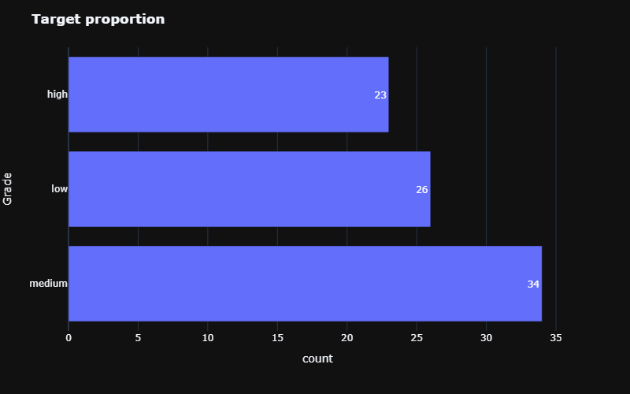
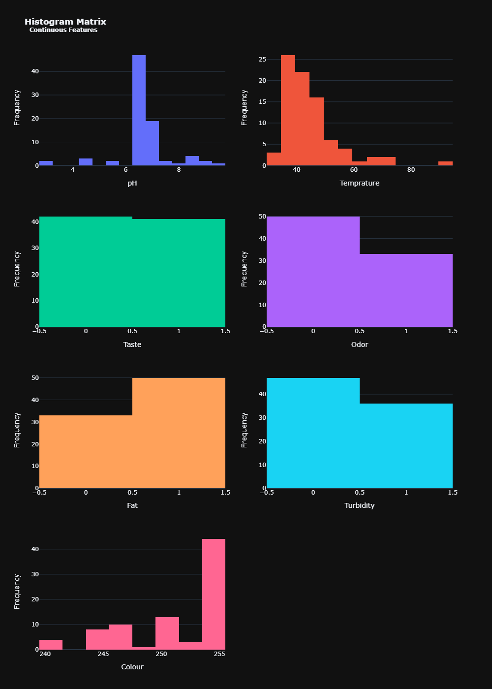
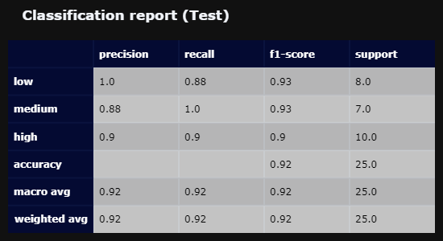

# Milk Quality
This project cover the classification of quality low, medium
and high for milk trough features described in data section. After a exploratory data analysis and due the dataset size, Naive Bayes classifier was selected for solve the task. Other models  as SVM and Random Forest were tested as baselines without remarkable performance. nbClassifier was deployed as an API REST with FastAPI. 

## Data Description
(From [Kaggle](https://www.kaggle.com/datasets/cpluzshrijayan/milkquality/data))
This dataset is manually collected from observations. It helps us to build machine learning models to predict the quality of milk.
This dataset consists of 7 independent variables ie pH, Temperature, Taste, Odor, Fat, Turbidity, and Color.
Generally, the Grade or Quality of the milk depends on these parameters. These parameters play a vital role in the predictive analysis of the milk.

### Usage
The target variable is nothing but the Grade of the milk. It can be.

### Target

- Low (Bad)
- Medium (Moderate)
- High (Good)

If Taste, Odor, Fat, and Turbidity are satisfied with optimal conditions then they will assign 1 otherwise 0.
Temperature and ph are given their actual values in the dataset.

Inspiration: To leverage the benefits of machine learning in the dairy industry.

Project covers:
- Data Cleaning and Handle Duplicated
- EDA
- Dimensional Reduction Analysis
- Modelling
- Deployment

## EDA
The available data contain a lot of duplicated samples, after remove it, data decreased significantly:

  

All features are numeric:

## Visualize Dimensional Reduction
As an exercise, a PCA and t-SNE was developed showing the next results:

 
  
  

As we can see, high and medium quality share space, risk inferring that the difference between medium and high quality is very small.

## Modelling
SVM, Random Forest and KNN Classifier was developed but none of the above models reach better results than Naive Bayes Classifier. The baselines for each of the above models yielded an accuracy on the test set of:

~           |nbClassifier   |Random Forest  |SVM           |KNN|
:----------:|:-------------:|:-------------:|:-------------:|:-------------:
Accuracy    | 0.92          |0.76           |0.84          |0.68|

## Test
Matriz confusion shows:

On the other hand classification report is shown:

## Deployment

API was builded using FastAPI with a POST method. Request and response functions were developed by classes inherited from Basemodel (pydantic library) for consume appropiate data. 

